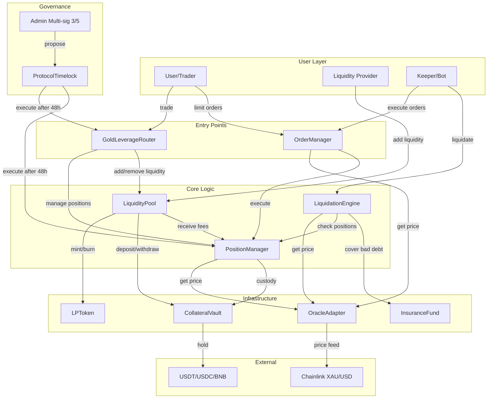
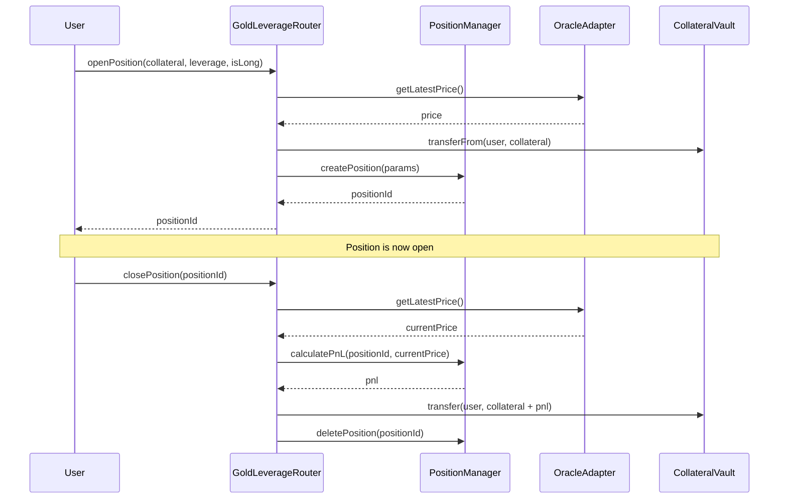
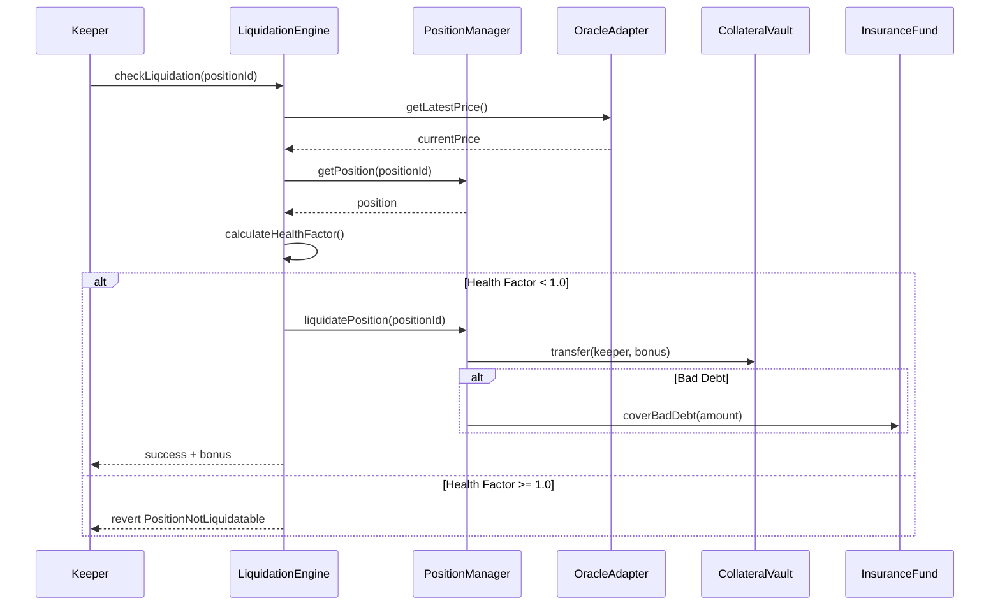

# Paimon Gold Protocol - Architecture Documentation

## Contract Architecture

## Contract Interactions

### Position Lifecycle

### Liquidation Flow

## Contract Summary

| Contract | Purpose | Access Control |
|----------|---------|----------------|
| GoldLeverageRouter | Unified entry point for all user operations | Pausable by PAUSER_ROLE |
| PositionManager | Position lifecycle (open/close/adjust) | Owner can pause |
| LiquidationEngine | Monitor and execute liquidations | Keeper-callable |
| OrderManager | Limit orders, TP/SL orders | Keeper-callable for execution |
| LiquidityPool | LP deposits/withdrawals, fee distribution | Owner can pause |
| CollateralVault | Secure collateral custody | Restricted to trusted contracts |
| OracleAdapter | Chainlink price feed wrapper | Owner can update config |
| LPToken | ERC20 LP token | Minting restricted to LiquidityPool |
| InsuranceFund | Bad debt coverage | Governance-controlled |
| ProtocolTimelock | 48h delay for admin operations | Multi-sig controlled |

## Key Security Features

### 1. Flash Loan Protection
- Minimum 10 blocks (~30s) hold time for positions
- Prevents same-block open/close attacks

### 2. Oracle Safety
- Staleness check (< 1 hour)
- Price deviation check (< 5%)
- Circuit breaker for anomalies

### 3. Access Control
- Multi-sig (3/5) for admin operations
- 48-hour timelock for sensitive changes
- Role-based access (ADMIN, KEEPER, PAUSER)

### 4. Reentrancy Protection
- ReentrancyGuard on all state-changing functions
- SafeERC20 for all token transfers

## Deployed Addresses (Testnet)

| Contract | Address |
|----------|---------|
| GoldLeverageRouter | TBD |
| PositionManager | TBD |
| LiquidationEngine | TBD |
| OrderManager | TBD |
| LiquidityPool | TBD |
| CollateralVault | TBD |
| OracleAdapter | TBD |
| LPToken | TBD |
| InsuranceFund | TBD |
| ProtocolTimelock | TBD |
